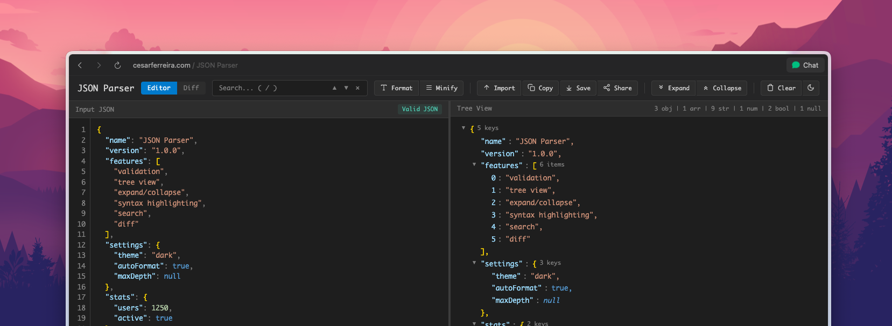

# JSON Toolkit

A fast, in-browser JSON editor with validation, formatting, tree view, and diffing.

## Screenshot



## Features

- Validate and syntax-highlight JSON as you type
- Format, minify, copy, and download JSON
- Tree view with expand/collapse, stats, and JSON path copy
- Search across keys and values with next/previous navigation
- Side-by-side diff mode with change summary
- Import from URL and share via compressed URL
- Light/dark theme toggle

## Development

Install dependencies:

```bash
npm install
```

Run the dev server:

```bash
npm run dev
```

Build for production:

```bash
npm run build
```

Preview the build:

```bash
npm run preview
```
